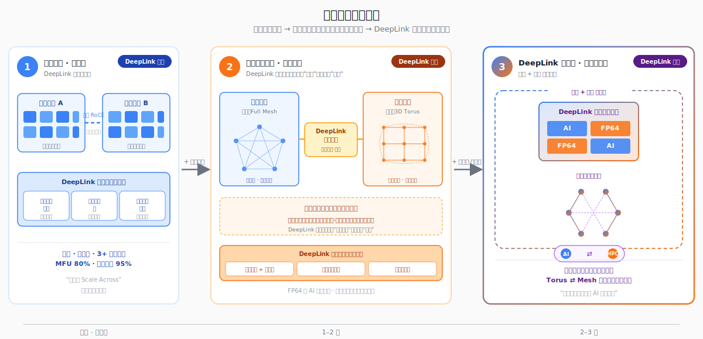

# 算力体系

DeepLink Next 的算力体系沿着三个阶段展开：先从软件层面打通跨域混训，再用专用硬件连接超算与智算，最终走向芯片到集群的完整融合。

---

## 软件 Scale Across — 跨域混训

单数据中心受供电、面积与单一芯片生态的约束，难以支撑下一代万亿参数训练。DeepLink 完全用软件在通用 RoCE 网络上抹平跨域差异——这就是 NVIDIA 后来命名为 Scale Across 的方案，但 DeepLink 在此之前已经跑通。

任务智能切片将模型按计算图拓扑自动分解，长距通信库在通用网络上实现千公里级高效传输，异构混训框架让 3+ 款国产芯片在同一任务中协同。万卡规模、千公里距离，已在生产环境验证。

---

## 跨域硬件 — 打通超算与智算

软件解决了跨域互联。但智算中心的 GPU 集群和超算中心的 CPU 集群在物理上仍是两个世界：内部组网（Full Mesh vs 3D Torus）、通信模式（AllReduce vs Neighbor）、计算精度（FP16 vs FP64）——每一层都在讲不同的语言。

DeepLink 在软件栈上叠加自研跨域专用硬件——距离感知 IP 核、链路加速引擎、协议转换桥——实现远程高速 RDMA 传输，让 FP64 科学解算与 AI 训推任务跨域流转。这一阶段解决了互联，但集群内部的架构差异仍未解决。

---

## 超智融合 — 芯片到集群的完整统一

真正的答案是芯片与系统架构同时融合。单片承载 AI Tensor Core 与 FP64 Unit，片上统一缓存让 AI 与 HPC 共享 L2 Cache。同一物理网络通过可重构链路同时承载 Full Mesh 集合通信与 3D Torus 邻近通信，按负载动态切换。

从芯片到硬件到集群，不再有两套体系。科学计算和 AI 在同一架构上原生运行。

---

## 超节点技术体系

[SuperPod Technical White Paper](https://deeplink-org.github.io/superpod-whitepaper/) v1.0，联合 **8 所高校及科研机构**、**16 家产业伙伴**共同编著。全书六章，从架构分析到未来演进，配套 SuperPod Pareto Index (SPI) 评估框架与产业生态地图。

[:material-book-open-page-variant: 阅读白皮书](https://deeplink-org.github.io/superpod-whitepaper/)
