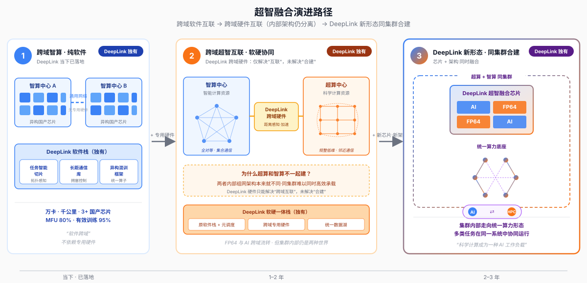

# 算力体系

DeepLink Next 的算力体系沿着三个阶段展开：先从软件层面打通跨域混训，再用 `DeepLink.Across` 建设跨域互联能力，最终通过 `DeepLink.Fabric` 走向下一代算力架构。

---

## 阶段一：软件跨域 — 异构算力先可用

单数据中心受供电、面积与单一芯片生态的约束，难以支撑下一代大规模训练。DeepLink 首先通过软件方式抹平跨域差异，让异构算力先可用。

任务智能切片将模型按计算图拓扑自动分解，长距通信库在通用网络上实现千公里级高效传输，异构混训框架让 3+ 款国产芯片在同一任务中协同。万卡规模、千公里距离，已在生产环境验证。

---

## 阶段二：DeepLink.Across

软件跨域让异构算力先可用，而 `DeepLink.Across` 面向跨地域、跨中心的算力连接能力建设，让已建成算力资源能够以更统一的方式参与上层训推任务。

`DeepLink.Across` 强调 DeepLink 自身的跨域互联阶段，与后续 `DeepLink.Fabric` 形成递进关系。

---

## 阶段三：DeepLink.Fabric

`DeepLink.Fabric` 面向下一代算力架构底座，让跨域算力、异构算力和上层运行时能够在统一体系中协同演进。

Across 与 Fabric 的关系是递进而不是替代：`DeepLink.Across` 解决跨域连接问题，`DeepLink.Fabric` 承接更高层次的算力架构统一。

---

## 超节点技术体系

[SuperPod Technical White Paper](https://deeplink-org.github.io/superpod-whitepaper/) v1.0，联合 **8 所高校及科研机构**、**16 家产业伙伴**共同编著。全书六章，从架构分析到未来演进，配套 SuperPod Pareto Index (SPI) 评估框架与产业生态地图。

[:material-book-open-page-variant: 阅读白皮书](https://deeplink-org.github.io/superpod-whitepaper/)
