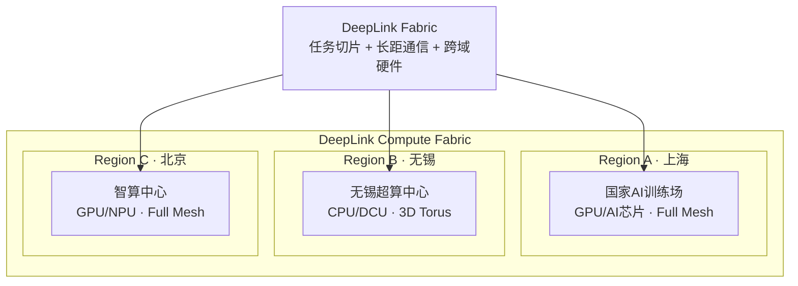

# 计算织网 (Compute Fabric)

计算织网是 DeepLink Next 的核心架构抽象。它将分布在多个数据中心、超算中心和智算中心的异构算力资源编织成一个统一的、可编程的计算平面。

## 为什么需要计算织网？

传统架构中，智算中心的 GPU 集群和超算中心的 CPU 集群是两个完全独立的体系：

| 维度 | 智算中心 | 超算中心 |
|------|:------:|:------:|
| 内部组网 | Full Mesh（全对等） | 3D Torus（规整低维） |
| 通信模式 | 集合通信 (AllReduce) | 邻近通信 (Neighbor) |
| 计算精度 | FP16/BF16/INT8 | FP64 |
| 典型工作负载 | 大模型训练/推理 | 科学仿真与解算 |
| 芯片生态 | NVIDIA + 国产 AI 芯片 | x86 + 国产 CPU |

DeepLink 的计算织网将这些 "算力孤岛" 连接起来：

## 三个阶段的计算织网

### 阶段一：软件织网

纯软件层面实现跨域智算互联。通用 RoCE 网络 + DeepLink 三层软件栈，已在生产环境验证万卡千公里跨域混训。

### 阶段二：软硬协同织网

叠加跨域专用硬件，连接智算与超算。解决了超算-智算之间的物理互联，但内部架构的差异仍未解决。

### 阶段三：统一织网

通过超智融合芯片 + 可重构组网，计算织网第一次在**集群内部**实现架构统一。Full Mesh 和 3D Torus 不再是两种物理网络，而是同一张网络上的两种可切换模式。
