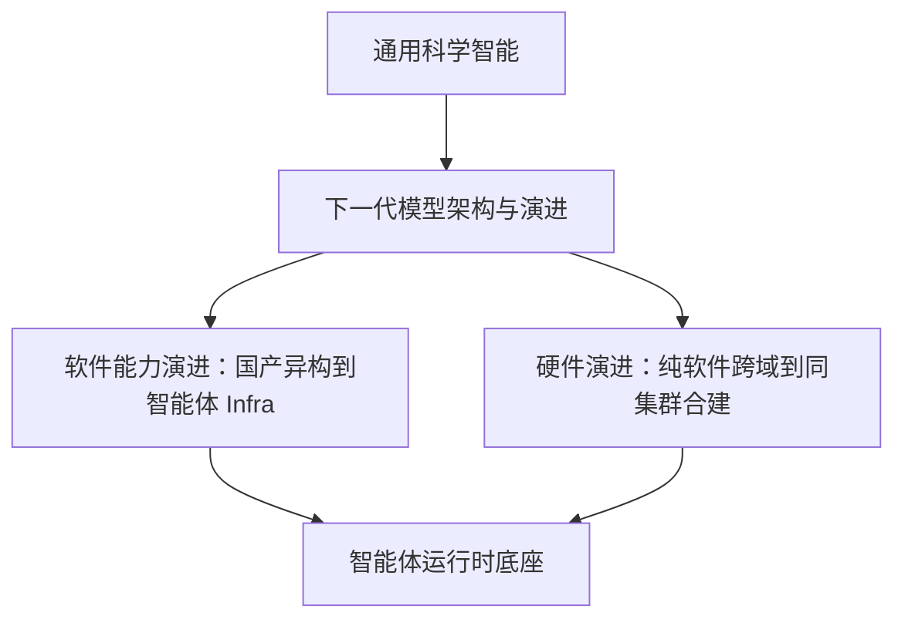

# 核心概念

## 从超智融合到通用科学智能

DeepLink Next 的核心概念已经从单一的“超智融合”扩展为一套面向通用科学智能的算力体系：软件能力持续上移，硬件体系持续融合，智能体运行时成为连接模型、科学任务与算力系统的中间层。

## 关键概念

- :material-target:{ .lg .middle } __通用科学智能__

    长期战略牵引目标。DeepLink Next 以 AI 模型演进为入口，最终服务科学问题的自动化求解。

- :material-source-branch:{ .lg .middle } __软件能力演进__

    国产异构 → 超大规模训推 → 智能体 Infra。软件能力从底层适配持续上移到智能体系统。

- :material-robot-outline:{ .lg .middle } __Agent Infra__

    面向长期运行、状态管理、环境探索和安全执行的智能体基础设施，不只是推理服务扩展。

- :material-memory:{ .lg .middle } __硬件演进__

    纯软件跨域 → 软硬协同 → 同集群合建。硬件从互联工具演进为体系结构共同设计。

- :material-vector-polyline:{ .lg .middle } [__计算织网__](compute-fabric.md)

    跨集群、跨区域、跨超算-智算的算力互联平面，是跨域训练和超智互联的基础。

- :material-target:{ .lg .middle } __同集群合建__

    超算与智算在同一物理集群内合建运行，让科学计算成为一种 AI 工作负载。

## 两条演进轴

> 软件能力解决“模型和智能体如何运行”，硬件演进解决“算力系统如何被建造”。两者共同服务通用科学智能目标。

[:material-arrow-right: 探索架构设计](../architecture/index.md)
[:material-arrow-right: 查看整体路线图](../overview/index.md)
