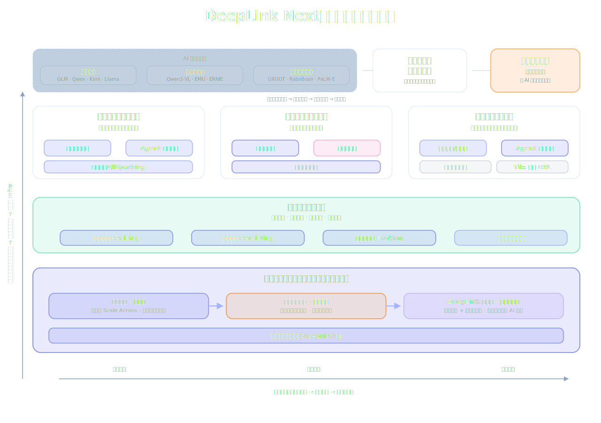

---
hide:
  - navigation
  - toc
---

<section class="landing-hero" markdown>
<div class="landing-hero__content" markdown>

# 面向通用科学智能的下一代算力基础设施

DeepLink Next 建设面向 AI 模型、Agent Infra 与科学计算的新一代算力系统，让软件能力与硬件架构共同演进。

[查看整体路线图](overview/index.md){ .md-button .md-button--primary }
[探索架构设计](architecture/index.md){ .md-button }

_DeepLink Next 面向通用科学智能，以 AI 模型演进为产业入口，以同集群合建为长期算力底座。_

</div>
</section>



---

## 双线演进

<div class="evolution-grid" markdown>
<div class="evolution-card phase-1" markdown>
### :material-source-branch: 软件能力演进

**国产异构 → 超大规模训推 → 智能体 Infra**

从最早的跨域异构混训开始，DeepLink Next 将软件能力持续上移：先解决国产异构算力可用，再支撑超大规模训推，最终形成面向长期任务执行的 Agent Infra。

:material-check-circle: 任务智能切片 · 长距通信 · 异构混训  
:material-check-circle: 智能体持续学习 · 池化执行 · 科学智能编程  
:material-check-circle: Pulsing · Persisting · Probing · 分布式沙箱
</div>

<div class="evolution-card phase-2" markdown>
### :material-memory: 硬件体系演进

**纯软件跨域 → 软硬协同 → 同集群合建**

硬件路线从“软件版 Scale Across”起步，逐步加入跨域专用硬件，最终走向融合芯片、可重构组网和超算智算同集群合建。

:material-alert-circle: 阶段二解决“互联”，但尚未解决“合建”  
:material-star: 阶段三让科学计算成为一种 AI 工作负载
</div>

<div class="evolution-card phase-3" markdown>
### :material-robot-outline: 智能体运行时底座

**连接模型、Agent 与算力**

智能体系统不是普通推理服务的扩展，而是长期运行、状态管理、环境探索和安全执行的基础设施。运行时底座让持续学习、池化执行与科学智能编程在同一体系中协同。

:material-check-circle: 分布式振荡 Pulsing  
:material-check-circle: 分层存储 Persisting  
:material-check-circle: 分布式调试 Probing  
:material-check-circle: 分布式沙箱系统
</div>
</div>

---

## 工程抓手

<div class="grid cards" markdown>

- :material-target:{ .lg .middle } __通用科学智能__

    长期战略牵引目标，以 AI 模型演进为入口，以科学问题求解为最终检验

- :material-brain:{ .lg .middle } __下一代模型架构__

    语言、多模态、具身智能模型共同驱动软件与硬件体系升级

- :material-robot-outline:{ .lg .middle } __Agent Infra__

    持续学习、池化执行、科学智能编程和智能体运行时底座

- :material-chip:{ .lg .middle } __同集群合建__

    从跨域互联走向融合芯片与可重构组网，统一超算与智算

- :material-vector-polyline:{ .lg .middle } __科学算子/仿真库__

    将科学计算知识、自动编程和异构编译连接成可复用工程能力

- :material-chart-timeline-variant:{ .lg .middle } __负载建模与仿真__

    通过 Blueprinting 让模型、Agent 和硬件架构可以被设计、验证与迭代

</div>

---

## 一句话理解

<div class="logic-flow" markdown>

```
通用科学智能
  ↑
下一代模型架构与演进
  ├─ 软件能力演进：国产异构 → 超大规模训推 → 智能体 Infra
  └─ 硬件演进：纯软件跨域 → 软硬协同 → 同集群合建
```

</div>

DeepLink Next 用工程路线承接战略目标：政府看到通用科学智能的长期牵引，产业看到 AI 模型、国产异构、超大规模训推和 Agent Infra 的可落地路径。

---

## 加入我们

DeepLink Next 是浦江实验室 DeepLink 项目的下一代演进。我们欢迎学术界与产业界的合作伙伴共同推进超智融合的边界。

[:material-github: GitHub](https://github.com/deeplink-org){ .md-button }
[:material-email: 联系我们](mailto:deeplink@pjlab.org.cn){ .md-button }
[:material-calendar: 合作研讨](https://deeplink.io/events){ .md-button }
