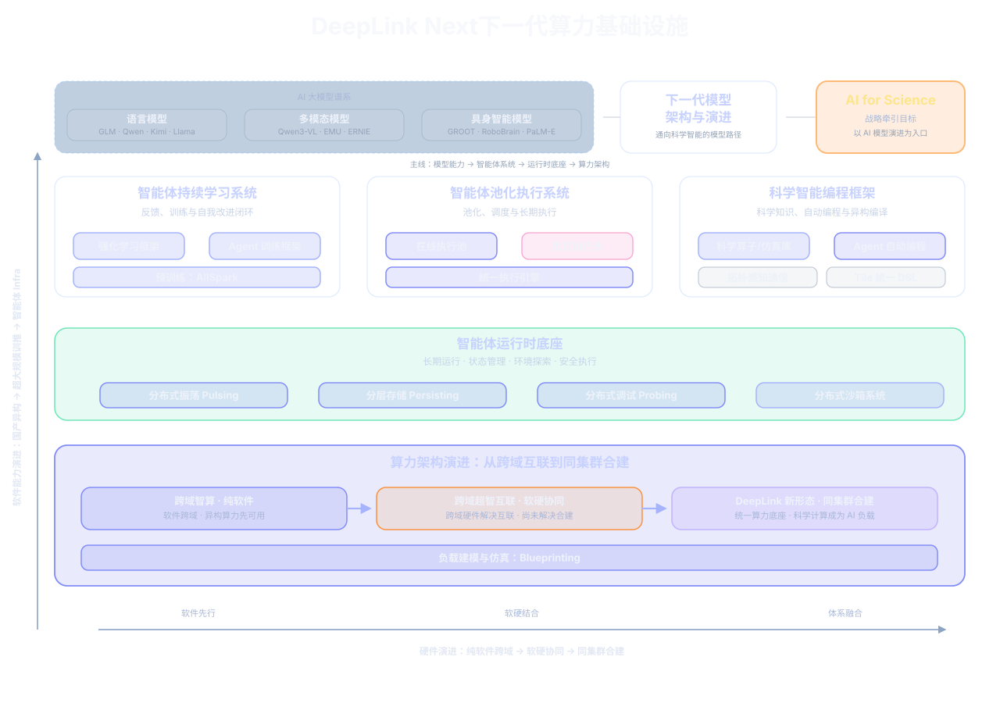

---
hide:
  - navigation
  - toc
---

<section class="landing-hero" markdown>

# AI4S 的开放算力基座

AI for Science 正在成为科学发现的新范式。DeepLink Next 以 `DeepLink.Across` 连接跨域算力，以 `DeepLink.Fabric` 构建下一代互联底座，并以 Agent Runtime 承接训推任务的调度、观测与管控。

[查看路线图](overview/roadmap.md){ .md-button .md-button--primary }
[探索架构设计](architecture/index.md){ .md-button }

</section>

---

## 两条主线

### :material-code-braces: 软件线 — 驾驭算力

**芯片协同 → 规模训练 → 智能运行**

从统一算子抽象让国产芯片共同工作，到持续学习与池化执行体系支撑超大规模训推，再到智能体运行时让 AI 长期自主运行。每一步都在回答：算力如何被有效使用。

### :material-memory: 硬件线 — 造出算力

**纯软件跨域 → DeepLink.Across → DeepLink.Fabric**

从让跨域异构算力先可用，到 DeepLink.Across 承接跨域互联，再到 DeepLink.Fabric 支撑下一代算力架构。每一步都在回答：算力从何而来。

---

## 继续探索

- :material-map-outline:{ .lg .middle } __查看路线图__

    季度级里程碑、交付物清单、2026–2028 时间线。

    [:material-arrow-right: 了解我们什么时候交付什么](overview/roadmap.md)

- :material-sitemap-outline:{ .lg .middle } __深入技术架构__

    四层施工图、核心组件详解、软硬协同演进路径。

    [:material-arrow-right: 了解我们怎么设计](architecture/index.md)

- :material-handshake-outline:{ .lg .middle } __参与生态__

    合作层级、署名成果、项目收录。无论你代表企业、高校还是个人。

    [:material-arrow-right: 找到你的角色](about/index.md)

