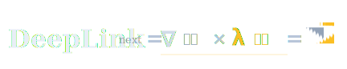

# Scaling beyond Intelligence

算力的演进，从来不只是变得更快更大——而是在一切尺度上持续 Scaling：突破距离的边界，打破尺度的极限，重塑计算的范式。

DeepLink Next 致力于打破智算与超算之间的架构壁垒，通过软件-硬件-芯片-架构的逐层创新，构建一个统一的、可编程的超级计算平面。

{ width="640" }

顶栏与收藏夹上的标志由 **∇** 与 **λ** 并排而成，上图把读法写清楚：**DeepLink next = ∇ 科学 × λ 计算 =（徽标）**——品牌名与文字读法在左，最右侧是图形标志。中间的 **×** 不是「相乘」的意思，而是说科学侧与计算侧要在同一套基座上交会、对齐。

- **∇ 科学**：常见于描述场、梯度与物理规律的书写里；在机器学习里，也常用来表示「沿什么方向优化」——把科学问题写成可计算的目标。
- **λ 计算**：在计算机理论里代表「可计算、可组合」的那一层抽象；在工程上，对应把训练、推理和智能体运行时接到算力平面上、能真正跑起来的软件。

我们讲 **AI4S**，就是科学发现与 AI 能力要在同一张可编程算力平面上规模化运行；这两个符号想表达的是：**场的语言**和**计算的语言**要在一起工作，而不是只做传统超算或只做模型服务其中一侧。

### 为什么是 AI4S

科学发现正在经历一次范式转移。蛋白质折叠、气象模拟、材料计算——这些领域不再只依赖传统 HPC 的数值解算，也依赖 AI 模型的模式识别与生成能力。但今天的算力基础设施还停留在「超算一套、智算一套」的割裂状态，科学家不得不在两套体系之间搬运数据和模型。

AI4S 的规模化，取决于一件事：能不能把超算和智算融合成一张可编程的算力平面。

中国在全球拥有数量最多的超算中心、最完整的工业科学数据体系、以及东数西算国家战略下的资源调度能力——这些是 AI4S 时代稀缺的结构性优势。DeepLink Next 的使命，就是把这些优势转化为一张统一的算力基座：让科学计算第一次可以在一个融合架构上规模化运行，而不必在两种体系之间做出妥协。

## 双线演进

DeepLink Next 沿着两条互为表里的主线向前推进：

- :material-memory:{ .lg .middle } __硬件线 — 造出算力__

    纯软件跨域 → 软硬协同 → 超融合。从让跨域异构算力先可用，到自研跨域硬件解决互联，最终走向融合芯片与可重构组网。每一步都在回答：**算力从何而来**。

- :material-code-braces:{ .lg .middle } __软件线 — 驾驭算力__

    芯片协同 → 规模训练 → 智能运行。从统一算子抽象让国产芯片共同工作，到持续学习与池化执行体系支撑超大规模训推，再到 Pulsing / Persisting / Probing 构成的 Agent 运行时。每一步都在回答：**算力如何被有效使用**。

两块拼图合在一起，才构成完整的 DeepLink Next——硬件决定算力的上限，软件决定能兑现多少。

## 设计原则

- :material-layers-triple:{ .lg .middle } __不跳跃，不妥协__

    软件 → 软件 + 硬件 → 芯片 + 架构融合。每一层真实解决前一层留下的问题，再用新问题驱动下一层。不靠概念跳跃跨过未攻克的关口，不因工程难度降低架构目标。

- :material-vector-combine:{ .lg .middle } __异构是起点，不是缺陷__

    国产芯片生态多元是既定现实。与其等待统一硬件标准，不如用协议和抽象层让差异在软件层被消解——统一算子抽象、长距通信库、异构混训框架，让 3+ 款芯片在同一任务中协同。

- :material-network:{ .lg .middle } __距离不应定义算力边界__

    从同机房到千公里之外——算力的物理分布不应构成上层任务的认知负担。DeepLink 让距离对训练透明，让科学家感知到的只是一片统一的算力。

- :material-swap-horizontal:{ .lg .middle } __融合，而非桥接__

    用桥接件连接两种已有架构只是权宜。真正的答案是创造统一的新架构——超智融合芯片 + 可重构组网，让科学计算与 AI 在同一集群内原生共存，而非跨域互访。

## 与现有路线的对比

| 路线 | 代表 | 跨域互联 | 异构混训 | 超智融合 | 超融合 |
|------|------|:---:|:---:|:---:|:---:|
| **DeepLink** | 浦江实验室 | :material-check:{ .check } | :material-check:{ .check } | :material-check:{ .check } | :material-check:{ .check } |
| Scale Across | NVIDIA | :material-check:{ .check } | :material-close:{ .cross } | :material-close:{ .cross } | :material-close:{ .cross } |
| 联邦学习 | Google/开源 | :material-check:{ .check } | :material-close:{ .cross } | :material-close:{ .cross } | :material-close:{ .cross } |
| 传统 HPC | 各国超算中心 | :material-close:{ .cross } | :material-close:{ .cross } | :material-close:{ .cross } | :material-close:{ .cross } |

## 2026 年目标

- **Q2** — 发布 DeepLink Next 技术白皮书，开放软件栈核心组件
- **Q3** — 启动跨域专用硬件原型验证，元调度器开源
- **Q4** — 完成超智融合芯片架构设计，发布 v1.0 技术规范

[:material-arrow-right: 查看完整路线图](roadmap.md)
