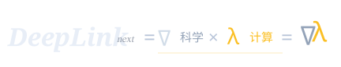

# Scaling beyond Intelligence

算力的演进，从来不只是变得更快更大——而是在一切尺度上持续 Scaling：突破距离的边界，打破尺度的极限，重塑计算的范式。

DeepLink Next 致力于打破智算与超算之间的架构壁垒，通过软件、跨域互联、下一代算力架构和 Agent Runtime 的逐层创新，构建一个统一的、可编程的超级计算平面。

{ width="640" }

顶栏与收藏夹上的标志由 **∇** 与 **λ** 并排而成，上图把读法写清楚：**DeepLink next = ∇ 科学 × λ 计算 =（徽标）**——品牌名与文字读法在左，最右侧是图形标志。中间的 **×** 不是「相乘」的意思，而是说科学侧与计算侧要在同一套基座上交会、对齐。

- **∇ 科学**：常见于描述场、梯度与物理规律的书写里；在机器学习里，也常用来表示「沿什么方向优化」——把科学问题写成可计算的目标。
- **λ 计算**：在计算机理论里代表「可计算、可组合」的那一层抽象；在工程上，对应把训练、推理和智能体运行时接到统一算力基座上、能真正跑起来的软件。

我们讲 **AI4S**，就是科学发现与 AI 能力要在同一套统一算力基座上规模化运行；这两个符号想表达的是：**场的语言**和**计算的语言**要在一起工作，而不是只做传统超算或只做模型服务其中一侧。

### 为什么是 AI4S

科学发现正在经历一次范式转移。蛋白质折叠、气象模拟、材料计算——这些领域不再只依赖传统 HPC 的数值解算，也依赖 AI 模型的模式识别与生成能力。但今天的算力基础设施还停留在「超算一套、智算一套」的割裂状态，科学家不得不在两套体系之间搬运数据和模型。

AI4S 的规模化，取决于一件事：能不能把超算和智算融合成统一的算力基座。

中国在全球拥有数量最多的超算中心、最完整的工业科学数据体系、以及东数西算国家战略下的资源调度能力——这些是 AI4S 时代稀缺的结构性优势。DeepLink Next 的使命，就是把这些优势转化为一张统一的算力基座：让科学计算第一次可以在一个融合架构上规模化运行，而不必在两种体系之间做出妥协。

## 双线演进

DeepLink Next 沿着两条互为表里的主线向前推进：

- :material-memory:{ .lg .middle } __硬件线 — 造出算力__

    纯软件跨域 → **DeepLink.Across** → **DeepLink.Fabric**。从让跨域异构算力先可用，到跨域互联能力建设，最终走向下一代算力架构底座。每一步都在回答：**算力从何而来**。

- :material-code-braces:{ .lg .middle } __软件线 — 驾驭算力__

    芯片协同 → 规模训练 → 智能运行。从统一算子抽象让国产芯片共同工作，到训推框架支撑超大规模训练与后训练，再到 Pulsing / Persisting / Probing 构成 Agent Runtime 的执行、状态与观测闭环。每一步都在回答：**算力如何被有效使用**。

两块拼图合在一起，才构成完整的 DeepLink Next：硬件决定算力的上限，软件决定能兑现多少。所谓软硬协同，不是额外提出一套原则，而是这两条线必须在同一个 AI4S 目标下相互约束、相互定义。

## 2026 年目标

- **Q2** — 发布 DeepLink Next 技术白皮书，开放软件栈核心组件
- **Q3** — 启动 DeepLink.Across 阶段验证，推进 Agent Runtime 与训推框架集成
- **Q4** — 完成 DeepLink.Fabric 阶段规范，发布 v1.0 技术规范
