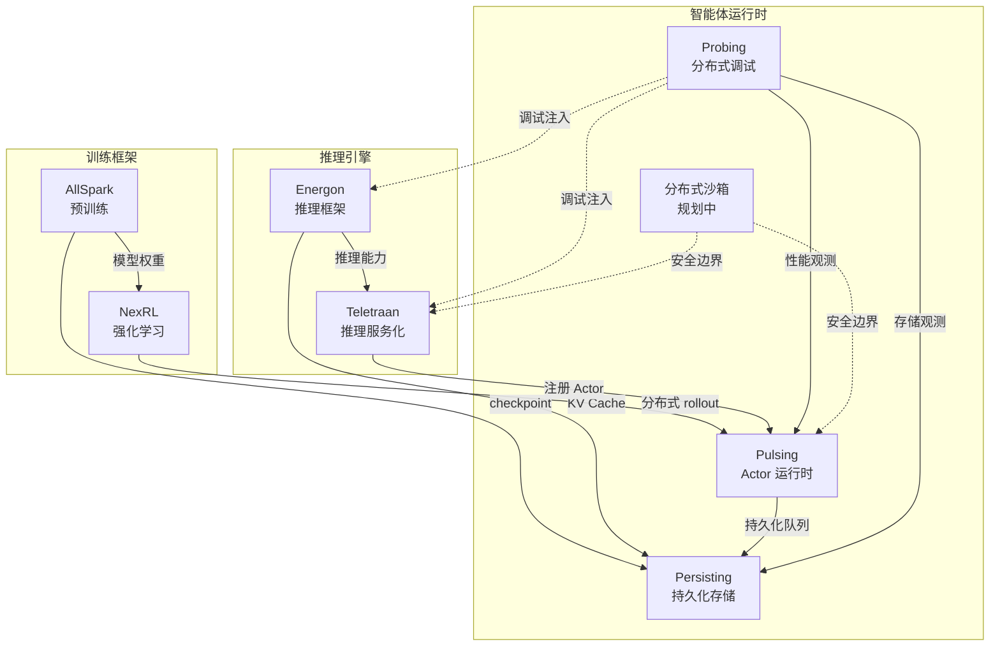

# 开源子项目

DeepLink Next 由多个独立的开源子项目构成，覆盖从模型训练、推理到智能体运行时的全链路。

## 训练框架

- :material-flash:{ .lg .middle } __AllSpark__

    ---

    大规模预训练框架。拓扑感知模型分片、跨域异构芯片统一训练入口、弹性容错恢复。与 NexRL 共享模型格式。

    :material-clock-outline: 规划中

- :material-chart-bell-curve:{ .lg .middle } __NexRL__

    ---

    分布式强化学习框架。大规模并行 rollout、在线/离线混合训练、面向科学任务的奖励建模。与 Pulsing 深度集成。

    :material-clock-outline: 规划中

## 推理引擎

- :material-battery-charging:{ .lg .middle } __Energon__

    ---

    高性能 LLM 推理框架。国产异构芯片后端、混合精度推理、Continuous Batching。命名源自变形金刚中驱动一切的 Energon 能量源。

    :material-clock-outline: 规划中

- :material-server:{ .lg .middle } __Teletraan__

    ---

    LLM 推理服务平台。OpenAI 兼容 API 网关、多模型路由、自动扩缩容。命名源自 Autobots 的中央超级计算机。

    :material-clock-outline: 规划中

## 智能体运行时

- :material-zigbee:{ .lg .middle } __Pulsing__

    ---

    分布式 Actor 运行时。零外部依赖、SWIM 协议自动发现、流式消息原生支持、Python First。定位在 Ray 和裸 async 之间。

    [:material-github: 项目站点](https://deeplink-org.github.io/Pulsing/)

- :material-database-outline:{ .lg .middle } __Persisting__

    ---

    分层持久化存储引擎。基于 Lance 列式格式，管理参数、KV Cache 与 Trajectories。可插拔后端架构，与 Pulsing 深度集成。

    [:material-github: 项目站点](https://deeplink-org.github.io/Persisting/)

- :material-bug-outline:{ .lg .middle } __Probing__

    ---

    零侵入分布式调试器。SQL 驱动的性能分析（Apache DataFusion）、动态代码注入、<5% 性能开销。

    [:material-github: 项目站点](https://deeplink-org.github.io/probing/)

- :material-shield-outline:{ .lg .middle } __分布式沙箱__

    ---

    Agent 安全执行与隔离环境。为不可信代码提供受限执行边界。

    :material-clock-outline: 规划中

---

## 生态关系

| 层级 | 数据流 | 说明 |
|------|--------|------|
| **训练 → 推理** | AllSpark → Energon | AllSpark 预训练产出的模型权重，由 Energon 加载执行推理 |
| **预训练 → RL** | AllSpark → NexRL | AllSpark 的基础模型作为 NexRL 强化学习的初始策略 |
| **RL → 运行时** | NexRL → Pulsing | NexRL 利用 Pulsing 的分布式 Actor 管理大规模并行 rollout |
| **推理框架 → 服务化** | Energon → Teletraan | Teletraan 基于 Energon 提供 OpenAI 兼容 API 与多模型路由 |
| **推理 → 存储** | Energon → Persisting | 推理过程中的 KV Cache 持久化到 Persisting，支持跨会话复用 |
| **服务化 → 运行时** | Teletraan → Pulsing | 每个推理服务实例注册为 Pulsing Actor，纳入统一的发现与调度 |
| **运行时内部** | Pulsing ↔ Persisting | Pulsing 的 Actor 状态与消息队列由 Persisting 提供持久化保障 |
| **全链路观测** | Probing → All | Probing 可注入任何运行中进程，提供统一的 SQL 驱动性能分析 |
| **安全隔离** | Sandbox → Pulsing/Teletraan | 沙箱为 Actor 执行和推理服务提供受限的安全边界 |

---

## 超节点技术体系白皮书

[SuperPod Technical White Paper](https://deeplink-org.github.io/superpod-whitepaper/) v1.0，2026 年 3 月发布，联合 **8 所高校及科研机构**、**16 家产业伙伴**共同编著。

全书六章：架构分析 → 软件系统 → 建模仿真 → 参考设计 → 未来演进 → 总结。配套 SuperPod Pareto Index (SPI) 评估框架与产业生态地图。

[:material-book-open-page-variant: 阅读白皮书](https://deeplink-org.github.io/superpod-whitepaper/){ .md-button }
